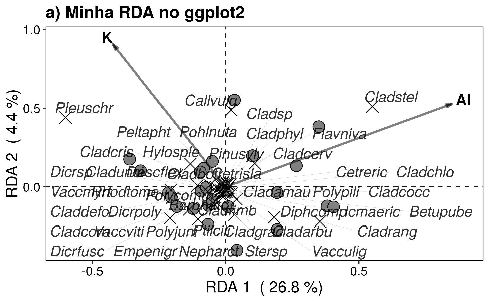
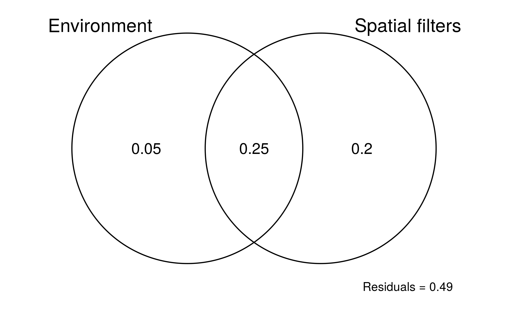
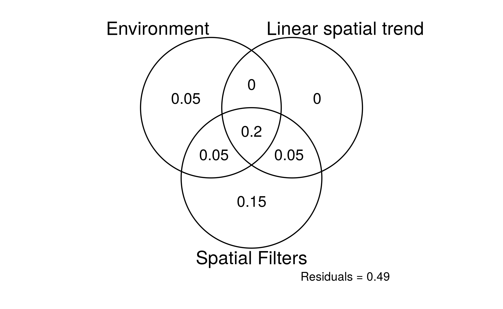

# rda_varpart_ggplot2
Script para gráficos dos resultados da RDA e do varpart do pacote `vegan`

# Conteúdo
Os scripts abaixo utilizam os dados disponíveis no pacote `vegan`.

### `rda_ggplot2.R` - plota os resultados de uma RDA.

### `venn_diagram_2_expl_ggplot2.R` - plota o diagrama de Venn para duas matrizes explanatórias

### `venn_diagram_3_expl_ggplot2.R` - plota o diagrama de Venn para três matrizes explanatórias

