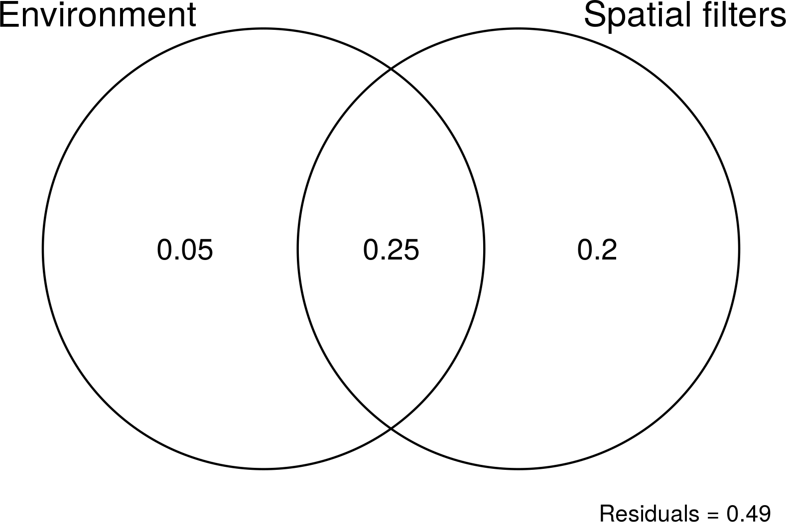
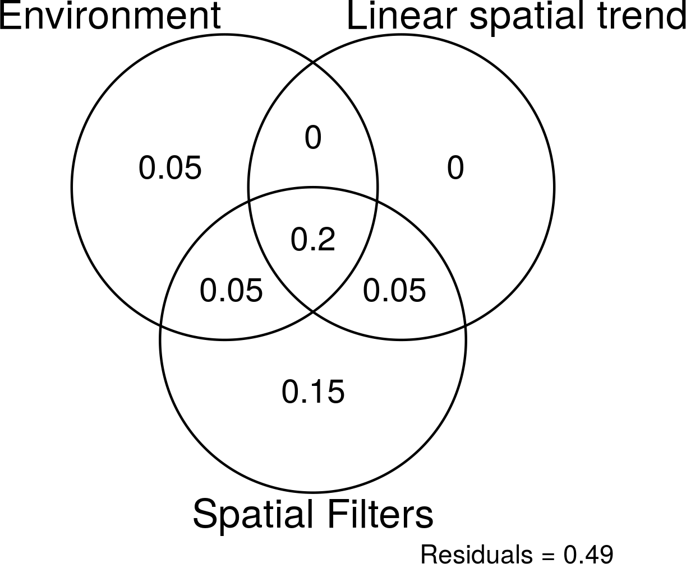

# rda_varpart_ggplot2
Script para gráficos dos resultados da RDA e do varpart do pacote `vegan`

## Conteúdo
Os scripts abaixo utilizam os dados disponíveis no pacote `vegan`.

|                    Script                   |                         Objetivo                        |
|:-------------------------------------------:|:-------------------------------------------------------:|
| [`rda_ggplot2.R`][rda]                      | Plota resultados do RDA                                 |
| [`venn_diagram_2_expl_ggplot2.R`][varpart2] | Plota diagrama de Venn para duas matrizes exploratórias |
| [`venn_diagram_3_expl_ggplot2.R`][varpart3] | Plota diagrama de Venn para três matrizes exploratórias |

[rda]: https://github.com/kguidonimartins/rda_varpart_ggplot2/blob/master/rda_ggplot2.R
[varpart2]: https://github.com/kguidonimartins/rda_varpart_ggplot2/blob/master/venn_diagram_2_expl_ggplot2.R
[varpart3]: https://github.com/kguidonimartins/rda_varpart_ggplot2/blob/master/venn_diagram_3_expl_ggplot2.R

# RDA

# Diagrama de Venn para duas matrizes explanatórias

# Diagrama de Venn para três matrizes explanatórias

# Referência consultadas

Legendre, P., & Legendre, L. (2012). Numerical Ecology, Volume 24, Third Edition (Developments in Environmental Modelling) (Vol. 1). Elsevier.

Borcard, D., Gillet, F., & Legendre, P. (2011). Numerical Ecology With R (Vol. 1). Springer.

# Scripts utilizados para a construção desses gráficos

[Curso de PCA da Renata Brandt e do Fábio Barros](https://renatabrandt.github.io/EBC2015/PCA.html)

[Diagrama de Venn usando `ggplot` e `ggforce` do Norbert Köhler](https://scriptsandstatistics.wordpress.com/2018/04/26/how-to-plot-venn-diagrams-using-r-ggplot2-and-ggforce/)
